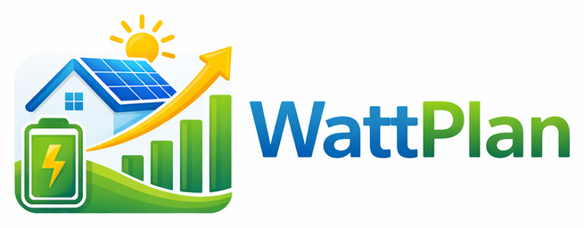

# WattPlan  

**WattPlan** is a Home Assistant custom integration designed for planning energy use based on price, usage, PV production, and battery storage. It is intended for users who want both the integration and the optimizer source to reside in a single repository, with a release flow that produces HACS-ready artifacts.

## Purpose
WattPlan aims to help users optimize their energy consumption by providing insights into how to best utilize available energy resources, including solar power and battery storage, while considering fluctuating energy prices. For example, users can plan their energy usage during peak price hours and utilize solar energy when available.

## Target Audience
This documentation is intended for Home Assistant users, energy enthusiasts, and developers looking to integrate energy management solutions into their smart home systems. Users should have a basic understanding of Home Assistant and energy management concepts.

## Key Benefits
- **Optimized Energy Use**: Make informed decisions about energy consumption based on real-time data.
- **Integration Flexibility**: Easily integrate with existing Home Assistant setups and other energy sources.
- **Community Support**: Engage with a community of users and developers to enhance your energy management experience.

## Quickstart
1. In HACS, open the menu in the top-right and choose `Custom repositories`.
2. Add `https://github.com/LordMike/WattPlan` with type `Integration`.
3. Search for `WattPlan` in HACS and install it.
4. Restart Home Assistant.
5. Go to `Settings` -> `Devices & Services` -> `Add Integration`, then add `WattPlan`.
6. Configure a price source. This is the only required forecast source and should reflect the real cost of buying from the grid.
7. Optionally configure a load/usage source if you want WattPlan to plan against expected household consumption.
8. Optionally configure a PV source if you have solar and want WattPlan to plan around it.
9. Optionally configure an export price source if you have PV and want exported power to carry a value instead of defaulting to zero.
10. Add [batteries, comfort loads, or optional loads](docs/extras.md) if you want WattPlan to control more than just forecasting.
11. Make automations to apply the WattPlan actions, to your devices - such as setting batteries to charge, or starting your HVAC

## Configuration Steps
After installing WattPlan via HACS, configure the following:
- **Price Source**: Required. Specify the source of your energy price data. This can be done using an entity adapter, service adapter, or template.
- **Usage Source**: Optional. Define how WattPlan should gather usage data if you want consumption-aware planning.
- **PV Source**: Optional. Set up your solar production data source if applicable.
- **Export Price Source**: Optional. If PV is configured, you can provide a value for exported power. Otherwise WattPlan treats export value as zero.
- **Optional Loads**: Optional. Configure any additional loads you wish to manage, such as batteries or comfort loads.

## Features
- Home Assistant custom integration with HACS-ready release artifacts
- Config-flow driven source setup for import price, export price, usage, and PV inputs
- Battery, comfort-load, and optional-load planning
- Planned actions are exposed as entities, so you can easily use the results to do automations
- Battery targets can be set and cleared through WattPlan services
- GitHub Actions for CI, tagged releases, prereleases, and `main` branch dev artifacts

## Documentation
- [docs/source-data.md](docs/source-data.md) - Source modes, data model, and how to feed WattPlan price, export price, usage, and PV data
- [docs/example-deye-solcast-stromligning.md](docs/example-deye-solcast-stromligning.md) - Concrete end-to-end example using Strømligning, Deye, and Solcast
- [docs/extras.md](docs/extras.md) - Batteries, comfort loads, optional loads, and how to wire WattPlan actions into your own automations
- [docs/entities-and-services.md](docs/entities-and-services.md) - All exposed entities and services, including battery targets
- [docs/optimizer-profiles.md](docs/optimizer-profiles.md) - What Aggressive, Balanced, and Conservative mean in practice
- [docs/error-handling.md](docs/error-handling.md) - Health states, degraded operation, and what `ok`, `degraded`, and `failed` mean
- [docs/development.md](docs/development.md) - Local setup with `uv`, local test env caveats, optional symlink workflow, packaging
- [docs/architecture.md](docs/architecture.md) - Code layout, runtime boundaries, planning flow
- [docs/release.md](docs/release.md) - Tags, prereleases, dev artifacts, GitHub release assets
- [docs/optimizer-api.md](docs/optimizer-api.md) - Direct optimizer API notes

## Limitations
While WattPlan is designed to optimize energy usage effectively, there are scenarios where it may not be the best fit:
- Users with highly variable energy prices may find it challenging to predict optimal usage.
- Integration with certain legacy systems may require additional configuration or may not be supported.

## Status
