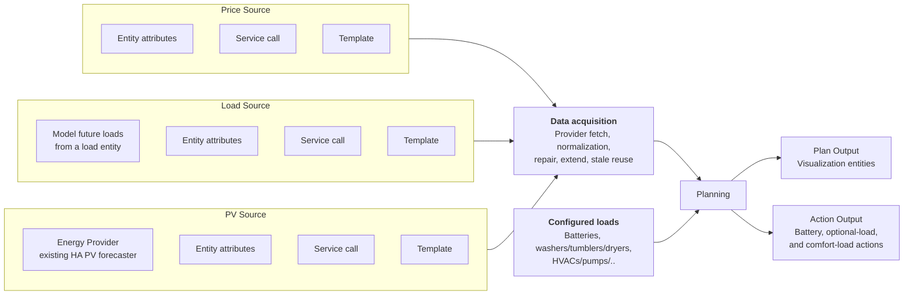

# Architecture

WattPlan is a single repository with two tightly related concerns:
- The Home Assistant custom integration in `custom_components/wattplan/`
- The optimizer implementation in `custom_components/wattplan/optimizer/`

The repository is structured so the integration can be released as a normal HACS artifact while the optimizer stays co-located and versioned with the integration.

## Layout
- `custom_components/wattplan/`
  - Home Assistant entry points, config flow, coordinator, entities, source handling, repairs
- `custom_components/wattplan/optimizer/`
  - Pure Python optimization models and solver code
- `tests/integration/`
  - Home Assistant integration tests
- `tests/optimizer/`
  - Optimizer-only tests that do not need Home Assistant runtime state

## Runtime Model
The main runtime center is the coordinator:
- `config_flow.py`: Collects source configuration and planner settings.
- `coordinator.py`: Builds planner input, runs planning, tracks stage errors, and updates runtime entities.
- `binary_sensor.py` / `sensor.py`: Expose planning state, diagnostics, and error scopes.
- `source_pipeline.py`, `source_provider.py`, `source_fixup.py`: Resolve raw source data and normalize it into planner-ready values.

## Data Acquisition
WattPlan acquires four planner input series:
- **Price**
- **Export price**
- **Usage**
- **PV**

Each source group stores one or more provider definitions. Supported provider modes depend on the source:
- Price and export price: entity adapter, service adapter, or template
- Usage: built-in history-based forecast, entity adapter, service adapter, or template
- PV: Home Assistant Energy solar provider, entity adapter, service adapter, or template

Every provider first resolves into timestamp/value points. The source pipeline then concatenates all provider output for that source before normalization, slot aggregation, repair, and fixup run once on the merged stream. Runtime planning can tolerate one provider failing or producing no usable points when another provider still covers the source.

The acquisition pipeline for each source is:
1. Select the configured provider mode and fetch raw payload or direct slot values.
2. Normalize the provider output into one numeric value per planner slot.
3. Apply slot-level aggregation when multiple values land in the same slot.
4. Optionally align timestamps to the nearest slot, repair gaps by resampling, and fill edges.
5. Optionally extend the tail with the value from 24 hours earlier when the source uses an extend-style fixup path.
6. Optionally reuse the last successful normalized window for a limited time when a refresh fails.

After this, the coordinator holds four slot-aligned numeric arrays that are passed to the optimizer:
- `grid_import_price_per_kwh`
- `grid_export_price_per_kwh`
- `usage_kwh`
- `solar_input_kwh`

Source health is tracked alongside the values. A source can be healthy, unavailable, or incomplete. Import price is required. Usage is optional to configure, but if configured and failing it blocks planning. PV and export price are non-blocking optional inputs; when unavailable, planning can continue with degraded assumptions.

## Planning Flow
The high-level planning flow looks like this:

## Optimizer Boundary
The optimizer package is intentionally kept free of `homeassistant` imports. The integration translates Home Assistant state into optimizer inputs and translates optimizer results back into entities, services, and diagnostics.

That boundary is the main extraction seam if the optimizer is ever split into its own package later.
