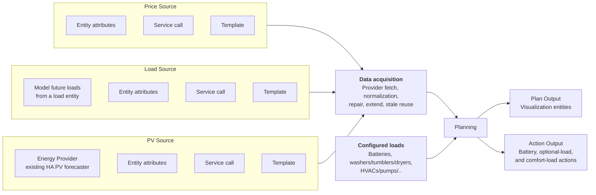

# Architecture

WattPlan is a single repository with two tightly related concerns:
- The Home Assistant custom integration in `custom_components/wattplan/`
- The optimizer implementation in `custom_components/wattplan/optimizer/`

The repository is structured so the integration can be released as a normal HACS artifact while the optimizer stays co-located and versioned with the integration.

## Layout
- `custom_components/wattplan/`
  - Home Assistant entry points, config flow, coordinator, entities, source handling, repairs
- `custom_components/wattplan/optimizer/`
  - Pure Python optimization models and solver code
- `tests/integration/`
  - Home Assistant integration tests
- `tests/optimizer/`
  - Optimizer-only tests that do not need Home Assistant runtime state

## Runtime Model
The main runtime center is the coordinator:
- `config_flow.py`: Collects source configuration and planner settings.
- `coordinator.py`: Builds planner input, runs planning, tracks stage errors, and updates runtime entities.
- `binary_sensor.py` / `sensor.py`: Expose planning state, diagnostics, and error scopes.
- `source_pipeline.py`, `source_provider.py`, `source_fixup.py`: Resolve raw source data and normalize it into planner-ready values.

## Data Acquisition
WattPlan acquires four planner input series:
- **Price**
- **Export price**
- **Usage**
- **PV**

Each source group stores one or more provider definitions. Supported provider modes depend on the source:
- Price and export price: entity adapter, service adapter, or template
- Usage: built-in history-based forecast, entity adapter, service adapter, or template
- PV: Home Assistant Energy solar provider, entity adapter, service adapter, or template

Every provider first resolves into timestamp/value points. The source pipeline then concatenates all provider output for that source before normalization, slot aggregation, repair, and fixup run once on the merged stream. Runtime planning can tolerate one provider failing or producing no usable points when another provider still covers the source.

The acquisition pipeline for each source is:
1. Select the configured provider mode and fetch raw payload or direct slot values.
2. Normalize the provider output into one numeric value per planner slot.
3. Apply slot-level aggregation when multiple values land in the same slot.
4. Optionally align timestamps to the nearest slot, repair gaps by resampling, and fill edges.
5. Optionally extend the tail with the value from 24 hours earlier when the source uses an extend-style fixup path.
6. Optionally reuse the last successful normalized window for a limited time when a refresh fails.

After this, the coordinator holds four slot-aligned numeric arrays that are passed to the optimizer:
- `grid_import_price_per_kwh`
- `grid_export_price_per_kwh`
- `usage_kwh`
- `solar_input_kwh`

The integration keeps plan coverage separate from economic lookahead. Plan coverage determines the length of these arrays and the complete schedule returned to Home Assistant. Economic lookahead determines how many future slots may influence each current MPC action. Users edit lookahead in hours, while config entries persist the resulting whole-slot value so the optimizer boundary stays resolution-independent. New setups default to 12 hours. Entries created before configurable lookahead are migrated once to the historical 22-slot value, displayed as 5.5 hours at 15-minute resolution, 11 hours at 30-minute resolution, or 22 hours at 60-minute resolution. Planner and comfort flows reject changes whose effective solve horizon is not longer than each comfort load's minimum ON/OFF duration.

Comfort runtime acquisition samples recorder history into ordered ON/OFF values
for the `rolling_window_slots - 1` completed slots immediately before the
forecast. Sampling ends at the planner request's exact forecast boundary rather
than the wall-clock instant, including when planning occurs partway through a
slot. The optimizer carries that order through each MPC step and opaque state so
every history/forecast and forecast-only rolling window is constrained.
If ordered history is unavailable, only aggregate credit guaranteed regardless
of ordering is used, and the returned plan is explicitly marked with
`comfort_history_unavailable`.

Source health is tracked alongside the values. A source can be healthy, unavailable, or incomplete. Import price is required. Usage is optional to configure, but if configured and failing it blocks planning. PV and export price are non-blocking optional inputs; when unavailable, planning can continue with degraded assumptions.

Battery assets are resolved independently before optimizer input is built. If a battery has an availability source and that binary sensor is `off`, the battery is omitted from the current optimizer request without degrading overall status. If availability cannot be trusted, or if an expected SoC value is missing or non-numeric, only that battery is omitted and the plan is marked degraded. The optimizer still receives the remaining batteries, comfort loads, optional loads, and can run with an empty battery list.

## Planning Flow
The high-level planning flow looks like this:

```mermaid
flowchart LR
  subgraph Price[Price Source]
    P1[Entity attributes]
    P2[Service call]
    P3[Template]
  end

  subgraph Load[Load Source]
    L1[Model future loads<br/>from a load entity]
    L2[Entity attributes]
    L3[Service call]
    L4[Template]
  end

  subgraph PV[PV Source]
    V1[Energy Provider<br/>existing HA PV forecaster]
    V2[Entity attributes]
    V3[Service call]
    V4[Template]
  end

  N[<b>Data acquisition</b><br/>Provider fetch, normalization,<br/>repair, extend, stale reuse]
  Loads[<b>Configured loads</b><br/>Batteries, washers/tumblers/dryers,<br/>HVACs/pumps/..]
  Plan[Planning]
  V[Plan Output<br/>Visualization entities]
  A[Action Output<br/>Battery, optional-load,<br/>and comfort-load actions]

  Price --> N
  Load --> N
  PV --> N

  N --> Plan
  Loads --> Plan

  Plan --> V
  Plan --> A
```

The coordinator snapshot retains complete time-indexed battery and comfort action schedules separately from the optional plan-detail diagnostic sensors. Action emission selects the slot covering the current time. A plan successfully calculated in the current runtime session continues to advance after a later planning failure, but a snapshot restored after restart is diagnostic-only until a fresh planning run succeeds. Restored battery, comfort, next-action, and optional-start recommendations cannot emit during that validation gap. The plan becomes unusable at the end of its recorded coverage; WattPlan then publishes failed health and makes plan-dependent actions unavailable instead of inventing a fallback action. Scheduler-heartbeat staleness is exposed separately from this action-validation state.

## Optimizer Boundary
The optimizer package is intentionally kept free of `homeassistant` imports. The integration translates Home Assistant state and wall-clock configuration into slot-based optimizer inputs, including `lookahead_slots`, and translates optimizer results back into entities, services, and diagnostics.

That boundary is the main extraction seam if the optimizer is ever split into its own package later.
