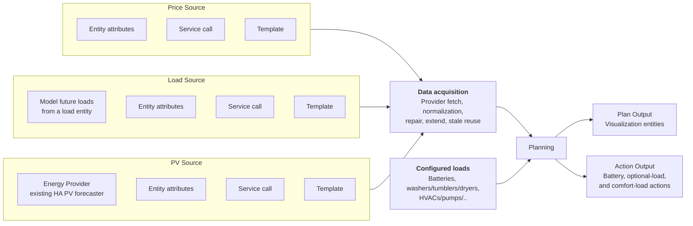

# Architecture

WattPlan is a single repository with two tightly related concerns:
- The Home Assistant custom integration in `custom_components/wattplan/`
- The optimizer implementation in `custom_components/wattplan/optimizer/`

The repository is structured so the integration can be released as a normal HACS artifact while the optimizer stays co-located and versioned with the integration.

## Layout
- `custom_components/wattplan/`
  - Home Assistant entry points, config flow, coordinator, entities, source handling, repairs
- `custom_components/wattplan/optimizer/`
  - Pure Python optimization models and solver code
- `tests/integration/`
  - Home Assistant integration tests
- `tests/optimizer/`
  - Optimizer-only tests that do not need Home Assistant runtime state

## Runtime Model
The main runtime center is the coordinator:
- `config_flow.py`: Collects source configuration and planner settings.
- `coordinator.py`: Builds planner input, runs planning, tracks stage errors, and updates runtime entities.
- `binary_sensor.py` / `sensor.py`: Expose planning state, diagnostics, and error scopes.
- `source_pipeline.py`, `source_provider.py`, `source_fixup.py`: Resolve raw source data and normalize it into planner-ready values.
- `historical_cost/`: Tracks opt-in historical cost facts in one HA Store per config entry and exposes daily/monthly cost and savings entities.

## Data Acquisition
WattPlan acquires four planner input series:
- **Price**
- **Export price**
- **Usage**
- **PV**

Each source group stores one or more provider definitions. Supported provider modes depend on the source:
- Price and export price: entity adapter, service adapter, or template
- Usage: built-in history-based forecast, entity adapter, service adapter, or template
- PV: Home Assistant Energy solar provider, entity adapter, service adapter, or template

Every provider first resolves into timestamp/value points. The source pipeline then concatenates all provider output for that source before normalization, slot aggregation, repair, and fixup run once on the merged stream. Runtime planning can tolerate one provider failing or producing no usable points when another provider still covers the source.

The acquisition pipeline for each source is:
1. Select the configured provider mode and fetch raw payload or direct slot values.
2. Normalize the provider output into one numeric value per planner slot.
3. Apply slot-level aggregation when multiple values land in the same slot.
4. Optionally align timestamps to the nearest slot, repair gaps by resampling, and fill edges.
5. Optionally extend the tail with the value from 24 hours earlier when the source uses an extend-style fixup path.
6. Optionally reuse the last successful normalized window for a limited time when a refresh fails.

After this, the coordinator holds four slot-aligned numeric arrays that are passed to the optimizer:
- `grid_import_price_per_kwh`
- `grid_export_price_per_kwh`
- `usage_kwh`
- `solar_input_kwh`

Source health is tracked alongside the values. A source can be healthy, unavailable, or incomplete. Import price is required. Usage is optional to configure, but if configured and failing it blocks planning. PV and export price are non-blocking optional inputs; when unavailable, planning can continue with degraded assumptions.

## Historical Cost Tracking

Historical tracking exists to answer a different question than the planner: whether the user's WattPlan setup is actually doing useful work over time. Forecasted savings can explain what the optimizer expected, but historical cost entities compare what happened with simple reference scenarios from the same measured energy facts.

Historical tracking runs independently from planner execution when enabled in options. It reads configured cumulative kWh meters for actual grid import, optional grid export, usage, and optional PV, then samples only completed slots aligned to the setup slot size. The retained data stores explicit UTC slot starts, one shared set of raw facts, self-consumption simulation outputs, and self-consumption SoC state. Saves are delayed/coalesced and flushed on unload or Home Assistant stop.

Scenarios are:
- `actual`: what happened in the home after all planning, automation, manual overrides, or lack of planning. It is measured grid import cost minus measured grid export value.
- `no_battery`: a reference where usage is served by PV first, any remaining usage is imported from the grid, and any PV surplus is exported. Batteries are ignored.
- `self_consumption`: a more realistic reference for many homes with batteries. PV serves usage first, PV surplus charges configured batteries in configured order, and batteries discharge before grid import. The simulation has no grid charging, no price awareness, and no preserve behavior.

Users should normally compare `actual` with `self_consumption` to see whether WattPlan's price-aware planning beats a simple self-consumption strategy. `no_battery` is useful as a broader reference for what the same usage and PV would have cost without battery behavior.

If a required meter is missing, non-numeric, or reset, or if Home Assistant skipped slots, WattPlan records a gap and resyncs cursors. It does not backfill recorder history or spread a multi-slot meter delta across varying prices.

Battery assets are resolved independently before optimizer input is built. If a battery has an availability source and that binary sensor is `off`, the battery is omitted from the current optimizer request without degrading overall status. If availability cannot be trusted, or if an expected SoC value is missing or non-numeric, only that battery is omitted and the plan is marked degraded. The optimizer still receives the remaining batteries, comfort loads, optional loads, and can run with an empty battery list.

## Planning Flow
The high-level planning flow looks like this:

```mermaid
flowchart LR
  subgraph Price[Price Source]
    P1[Entity attributes]
    P2[Service call]
    P3[Template]
  end

  subgraph Load[Load Source]
    L1[Model future loads<br/>from a load entity]
    L2[Entity attributes]
    L3[Service call]
    L4[Template]
  end

  subgraph PV[PV Source]
    V1[Energy Provider<br/>existing HA PV forecaster]
    V2[Entity attributes]
    V3[Service call]
    V4[Template]
  end

  N[<b>Data acquisition</b><br/>Provider fetch, normalization,<br/>repair, extend, stale reuse]
  Loads[<b>Configured loads</b><br/>Batteries, washers/tumblers/dryers,<br/>HVACs/pumps/..]
  Plan[Planning]
  V[Plan Output<br/>Visualization entities]
  A[Action Output<br/>Battery, optional-load,<br/>and comfort-load actions]

  Price --> N
  Load --> N
  PV --> N

  N --> Plan
  Loads --> Plan

  Plan --> V
  Plan --> A
```

## Optimizer Boundary
The optimizer package is intentionally kept free of `homeassistant` imports. The integration translates Home Assistant state into optimizer inputs and translates optimizer results back into entities, services, and diagnostics.

That boundary is the main extraction seam if the optimizer is ever split into its own package later.
