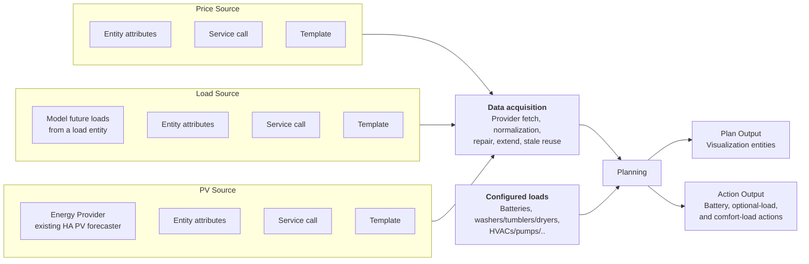

# Architecture

## Plan Outlook

`plan_outlook.py` builds a language-neutral model from captured planner inputs
and the accepted optimizer result. Facts contain semantic kinds, subjects,
timestamps, numeric display values, evidence, and relationships, but no rendered
sentences. `plan_outlook_renderer.py` supplies selected facts, display arguments,
and deterministic variant indexes to checked-in Project Fluent catalogues in
`locales/en/plan_outlook.ftl` and `locales/da/plan_outlook.ftl`; the catalogues
own complete messages, grammar, plurals, punctuation, and localized wording.
Displayed clock times are always paired with localized calendar context
(`today`, `tomorrow`, or a weekday); same-day ranges state the day once, while
cross-day ranges label both endpoints.
The renderer validates the catalogues before loading and uses the lower-level
Fluent bundle API so formatting failures remain explicit and non-fatal.

Entry setup resolves the Home Assistant system language plus any additional
advanced-option selections against the currently implemented renderers. The
resolved list is stored in entry runtime data and always contains at least one of
English or Danish. Locale tags intentionally resolve to their base language
(`da-DK` becomes `da`); unsupported language sets fall back to English.

Neither layer reads Home Assistant entities, uses diagnostic sensor arrays, or
runs another optimizer solve. The projection layer stores the bounded semantic
model and one rendering per configured language in the coordinator snapshot.
Each `sensor.<setup_slug>_plan_outlook_<language>` exposes a language-specific
report identifier as state and the headline, complete prose, and selection
metadata as attributes. A separate `semantic_id` fingerprints the shared
language-neutral meaning. When that identifier matches the preceding outlook,
each renderer reuses its own persisted phrase variants. The state combines the
main fact kind, information value, language, and a deterministic digest of the
selected facts and rendered wording, so visible report changes remain
trigger-friendly without being subject to Home Assistant's state-length limit.
Automations that care about meaning rather than phrase rotation should use the
`semantic_id` or `selected_facts` attributes instead of the sensor state.

The outlook describes forecasts and planned recommendations only. Restored plans
remain visible as a validation-status message rather than current action advice.
Balance claims require configured, healthy usage and PV sources; fallback zeroes
are not treated as evidence. Source and planning failures are reported after four
distinct affected planning slots (manual retries in one slot count once), while
loss or expiry of all usable recommendations is reported immediately. Recovery
clears the streak, and restart begins a new streak rather than inventing history.
When a sustained reliability fact is present, selection emits one prioritized
warning and suppresses precise energy advice. Compatibility groups also prevent
opposing or redundant price, solar, battery-policy, load-timing, and grid-balance
facts from appearing in the same report.

Selection uses relative tariff movement (18% of the observed absolute scale with
a 0.005 numerical floor), sustained multi-slot solar/export intervals, and both
absolute and relative energy floors. These internal thresholds deliberately avoid
assuming a currency. Eligible facts (unexpired, confidence at or above 0.5) are
scored for salience from significance, deviation, novelty against recent
history, timeliness toward the event start, minus a repetition penalty, then
the best valid 1–3 fact set is enumerated: the set base is the mean member
salience (quality over quantity, so mediocre filler cannot pad a strong pair),
with diminishing topic/group coverage and related-graph coherence adjustments
when a third fact is added. Coherence is scaled by the least-timely linked fact, so a routine
far-future action cannot borrow the full story value of a near-term price event;
price×action and causal pairs otherwise weigh double. A sustained reliability fact
short-circuits to one prioritized warning as before. Selection history is
bounded to 12 `kind.magnitude.period` semantic keys (magnitude tertiles are
`high`/`med`/`low`) and only advances when the selected story changes. The
selected set is aggregated into statements over the related graph
(single/cause/sequence/contrast/opportunity-action); the renderer voices each
statement's facts through the existing per-fact Fluent messages, derives the
report-level information value from the max significance band, and fingerprints
meaning (facts plus statement grouping, never wording or wall-clock salience)
in `semantic_id`. Persisted models are schema v2 with a v1 backward-compatible
loader (legacy int significance and `information_value` map onto the float
dims).

Every supported English and Danish fragment has at least three equivalent wording
variants. Common price, grid-use, charging, stale-data, refresh-failure, and quiet
reports have four. Variant selection is deterministic and remains fixed while the
semantic report is unchanged.

WattPlan is a single repository with two tightly related concerns:
- The Home Assistant custom integration in `custom_components/wattplan/`
- The optimizer implementation in `custom_components/wattplan/optimizer/`

The repository is structured so the integration can be released as a normal HACS artifact while the optimizer stays co-located and versioned with the integration.

## Layout
- `custom_components/wattplan/`
  - Home Assistant entry points, config flow, coordinator, entities, source handling, repairs
- `custom_components/wattplan/optimizer/`
  - Pure Python optimization models and solver code
- `tests/integration/`
  - Home Assistant integration tests
- `tests/optimizer/`
  - Optimizer-only tests that do not need Home Assistant runtime state

## Runtime Model
The main runtime center is the coordinator:
- `config_flow.py`: Collects source configuration and planner settings.
- `coordinator.py`: Builds planner input, runs planning, tracks stage errors, and updates runtime entities. It owns its scheduler: one `async_track_point_in_utc_time` timer aimed at the next slot boundary, re-armed after every run and cancelled on shutdown. It does not rely on `DataUpdateCoordinator`'s own refresh timer.
- `entry_setup.py`: Starts the scheduler after platform setup. On startup the cached snapshot is restored only if it was stored with the same configuration fingerprint (hash of entry data, options, and subentries) and its plan still covers the current time; otherwise it is discarded and the first plan is awaited during setup. A restored snapshot is trusted immediately and replaced by a plan that runs as a background task right after setup.
- `binary_sensor.py` / `sensor.py`: Expose planning state, diagnostics, and error scopes.
- `target_runtime.py` / `target_persistence.py`: Hold user battery targets from `wattplan.set_target` and persist them in a small per-entry store (`wattplan.targets.<entry_id>`), restored on setup. Expired targets and targets for removed batteries are dropped.
- `source_pipeline.py`, `source_provider.py`, `source_fixup.py`: Resolve raw source data and normalize it into planner-ready values.

## Data Acquisition
WattPlan acquires four planner input series:
- **Price**
- **Export price**
- **Usage**
- **PV**

Each source group stores one or more provider definitions. Supported provider modes depend on the source:
- Price and export price: entity adapter, service adapter, or template
- Usage: built-in history-based forecast, entity adapter, service adapter, or template
- PV: Home Assistant Energy solar provider, entity adapter, service adapter, or template

Every provider first resolves into timestamp/value points. The source pipeline then concatenates all provider output for that source before normalization, slot aggregation, repair, and fixup run once on the merged stream. Runtime planning can tolerate one provider failing or producing no usable points when another provider still covers the source.

The acquisition pipeline for each source is:
1. Select the configured provider mode and fetch raw payload or direct slot values.
2. Parse the payload into timestamp/value points. NaN and infinities are rejected as source parse failures; signed finite tariffs remain valid.
3. Align timestamps to the slot grid (or a whole fraction of a slot for finer sources), exactly or to the nearest grid point, and resolve duplicate timestamps with the aggregation mode in provider order.
4. Turn points into intervals capped at the source's typical spacing, then map them onto slots: prices (per kWh) repeat across the slots they cover and aggregate when several fall in one slot; usage and PV energy is split proportionally and summed. Usage/PV values given as average kW are converted to kWh first.
5. Optionally repair gaps by resampling and fill edges, then require one finite value per slot.
6. Optionally extend the tail with the value from 24 hours earlier when the source uses an extend-style fixup path.
7. Optionally reuse the last successful normalized window for a limited time when a refresh fails. Only fully finite windows can update this cache.

`docs/source-data.md` describes these rules from the user's side.

After this, the coordinator holds four slot-aligned numeric arrays that are passed to the optimizer:
- `grid_import_price_per_kwh`
- `grid_export_price_per_kwh`
- `usage_kwh`
- `solar_input_kwh`

The integration keeps plan coverage separate from economic lookahead. Plan coverage determines the length of these arrays and the complete schedule returned to Home Assistant. Economic lookahead determines how many future slots may influence each current MPC action. Users edit lookahead in hours, while config entries persist the resulting whole-slot value so the optimizer boundary stays resolution-independent. New setups default to 12 hours. Entries created before configurable lookahead are migrated once to the historical 22-slot value, displayed as 5.5 hours at 15-minute resolution, 11 hours at 30-minute resolution, or 22 hours at 60-minute resolution. Planner and comfort flows reject changes whose effective solve horizon is not longer than each comfort load's minimum ON/OFF duration.

Comfort runtime acquisition samples recorder history into ordered ON/OFF values
for the `rolling_window_slots - 1` completed slots immediately before the
forecast. Sampling ends at the planner request's exact forecast boundary rather
than the wall-clock instant, including when planning occurs partway through a
slot. The optimizer carries that order through its deterministic comfort
scheduler and opaque state so every history/forecast and forecast-only rolling
window is checked without adding comfort binaries to the battery MILP.
If ordered history is unavailable, only aggregate credit guaranteed regardless
of ordering is used, and the returned plan is explicitly marked with
`comfort_history_unavailable`.

Source health is tracked alongside the values. A source can be healthy, unavailable, or incomplete. Import price is required. Usage is optional to configure, but if configured and failing it blocks planning. PV and export price are non-blocking optional inputs; when unavailable, planning can continue with degraded assumptions.

Battery assets are resolved independently before optimizer input is built. If a battery has an availability source and that binary sensor is `off`, the battery is omitted from the current optimizer request without degrading overall status. If availability cannot be trusted, or if an expected SoC value is missing or non-numeric, only that battery is omitted and the plan is marked degraded. The optimizer still receives the remaining batteries, comfort loads, optional loads, and can run with an empty battery list.

When that list is empty, the optimizer does not construct battery/grid MILPs or
invoke HiGHS. Comfort candidates are valued directly from signed import/export
tariffs, base usage, and shared PV. Per-slot physical accounting then rebuilds
the accepted schedule and scores imports, exports, optional-load choices, state,
and cadence through the normal result path. `successful_solves` is therefore
zero for both full and prefix no-battery plans; cadence diagnostics still report
whether the request was a full plan or repair.

## Planning Flow
The high-level planning flow looks like this:

```mermaid
flowchart LR
  subgraph Price[Price Source]
    P1[Entity attributes]
    P2[Service call]
    P3[Template]
  end

  subgraph Load[Load Source]
    L1[Model future loads<br/>from a load entity]
    L2[Entity attributes]
    L3[Service call]
    L4[Template]
  end

  subgraph PV[PV Source]
    V1[Energy Provider<br/>existing HA PV forecaster]
    V2[Entity attributes]
    V3[Service call]
    V4[Template]
  end

  N[<b>Data acquisition</b><br/>Provider fetch, normalization,<br/>repair, extend, stale reuse]
  Loads[<b>Configured loads</b><br/>Batteries, washers/tumblers/dryers,<br/>HVACs/pumps/..]
  Plan[Planning]
  V[Plan Output<br/>Visualization entities]
  A[Action Output<br/>Battery, optional-load,<br/>and comfort-load actions]

  Price --> N
  Load --> N
  PV --> N

  N --> Plan
  Loads --> Plan

  Plan --> V
  Plan --> A
```

The coordinator snapshot retains complete time-indexed battery and comfort action schedules separately from the optional plan-detail diagnostic sensors. Action emission selects the slot covering the current time. A plan successfully calculated in the current runtime session continues to advance after a later planning failure, but a snapshot restored without a matching configuration fingerprint is diagnostic-only until a fresh planning run succeeds; at startup such snapshots are discarded instead. A snapshot restored at startup with a matching fingerprint that still covers the current time is trusted immediately, and a background plan refreshes it. The plan becomes unusable at the end of its recorded coverage; WattPlan then publishes failed health and makes plan-dependent actions unavailable instead of inventing a fallback action. Scheduler-heartbeat staleness is exposed separately from this action-validation state.

When troubleshooting recording is enabled, each accepted plan is additionally
appended off the event loop to one JSONL file per HA local date and config
entry. These self-contained optimizer request/result records are separate from
the restored coordinator snapshot and Home Assistant Recorder; write failures
do not change the accepted plan. A response service reads one daily file at a
time, while retention cleanup removes older daily files after successful
appends.

## Optimizer Boundary
The optimizer package is intentionally kept free of `homeassistant` imports. The integration translates Home Assistant state and wall-clock configuration into slot-based optimizer inputs, including `lookahead_slots`, and translates optimizer results back into entities, services, and diagnostics. It passes the aligned source-window start as `plan_start` together with `slot_minutes`; timestamps remain ordinary timezone-aware Python values inside the optimizer.

Battery grid charging is an executable on/off choice in the MPC solve. The
integration converts configured kW to kWh per slot; when the grid-charge policy
is ON, the solve and its per-slot tariff projections account for charging at
that full slot rate, with PV contribution and capacity saturation reducing the
necessary grid input. A near-full top-up is eligible only when at least half a
slot's input can fit, within numeric tolerance. The same full-rate policy is
used by fixed-policy replay.
The optimizer fingerprint rejects cached controls from the earlier continuous
grid-charge model, so an upgrade starts with a fresh battery solve.

`optimizer/prefix_planner.py` controls the timed planning cadence. It performs a full plan initially and after four slot advances, with eight freshly optimized near-term battery actions on intervening consecutive advances. Each fresh battery action retains the configured economic lookahead. Comfort actions first come from the deterministic constraint scheduler, then a bounded single-pass placement step may relocate existing ON runs without changing runtime. It preserves rolling history, current minimum-duration commitments, maximum-off limits, and terminal run feasibility. With batteries, candidates use fixed-policy replay from the current baseline plan; without batteries they use direct net-site cost. If accepted demand changes, cached battery controls are discarded and at most one additional battery planning pass rebuilds the actual plan. The result is retained only when its actual tariff cost does not worsen and hard constraints remain valid. Remaining prefix battery policies are reprojected against current forecasts and the final fixed comfort schedule, and a failed tail feasibility check forces full planning.

A full plan does not solve every slot. MPC solves run every slot for the first
eight hours of the plan (`FINE_HORIZON_MINUTES`), which covers every action the
prefix cadence can publish before the next full plan. Beyond that, one solve
runs per hour (`COARSE_BLOCK_MINUTES`) and the intermediate slots replay that
solve's own planned battery controls through the normal per-slot physics. A
replayed slot falls back to a real solve whenever the replay could not be
reproduced exactly: the planned charge or discharge would be clipped at the
actual level, a grid-charge ON slot lacks headroom, or its preserve flag would
need a counterfactual probe. Preserve and policy states therefore keep their
meaning in replayed slots. At 15-minute resolution this cuts a 48-hour full plan
from 192 to roughly 72 solves; the near-term schedule is identical to solving
every slot, while the later forecast is slightly less refined. Hourly or coarser
slots are unaffected.

Full deadband-enabled calculations pass native HiGHS partial MIP starts between
consecutive MPC solves. Only future overlapping integer mode assignments are
shifted, by the actual distance between the two solves; the current action slot
and newly appended terminal slot remain
unknown, and the previous decisions are never fixed as constraints. HiGHS may
use up to ten nodes to complete a partial start. A rejected start falls back to
the same cold model. Starts are enabled only when the effective initial solve
horizon is at least 40 slots; shorter measured workloads did not reliably repay
completion overhead. Prefix-only refreshes also skip starts because their small
solve count does not repay that overhead. Integer assignments are only extracted
from eligible full primary solves that will feed the next adjacent solve; prefix
solves, short-horizon solves, no-deadband solves, and preserve probes avoid
building unused hint dictionaries.

MILP constraints are assembled as sparse rows and passed to HiGHS in a
column-wise sparse matrix. The solver backend still accepts dense rows for
focused tests, but the MPC path never allocates a dense rows-by-variables model.

The opaque state includes bounded clock/configuration metadata, published battery policies, and expiry receipts for first-slot comfort commitments. Same-slot requests do not shift the schedule or consume another cadence phase. Missing/incompatible timing and skipped/reversed windows fall back to a full calculation. Untimed direct API calls retain their full-plan timing/reuse behavior and use the same deterministic comfort scheduler. A comfort-scheduler version in state fingerprints prevents reusing controls from the previous tariff-optimized model. Cached battery controls are also rejected if recomputing comfort changes the demand they were solved for. Future-tail freshness and fallback reasons are exposed in optimizer results, while the integration still publishes a complete schedule on each successful call.

That boundary is the main extraction seam if the optimizer is ever split into its own package later.
